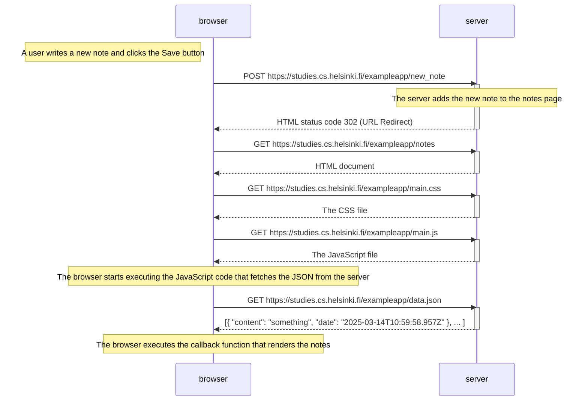

```mermaid
sequenceDiagram
    participant browser
    participant server

    Note left of browser: A user writes a new note and clicks the Save button
    
    browser->>server: POST https://studies.cs.helsinki.fi/exampleapp/new_note
    activate server

    Note over server: The server adds the new note to the notes page

    server-->>browser: HTML status code 302 (URL Redirect)
    deactivate server

    browser->>server: GET https://studies.cs.helsinki.fi/exampleapp/notes
    activate server
    server-->>browser: HTML document
    deactivate server

    browser->>server: GET https://studies.cs.helsinki.fi/exampleapp/main.css
    activate server
    server-->>browser: The CSS file
    deactivate server

    browser->>server: GET https://studies.cs.helsinki.fi/exampleapp/main.js
    activate server
    server-->>browser: The JavaScript file
    deactivate server

    Note over browser: The browser starts executing the JavaScript code that fetches the JSON from the server

    browser->>server: GET https://studies.cs.helsinki.fi/exampleapp/data.json
    activate server
    server-->>browser: [{ "content": "something", "date": "2025-03-14T10:59:58.957Z" }, ... ]
    deactivate server    

    Note over browser: The browser executes the callback function that renders the notes
```
