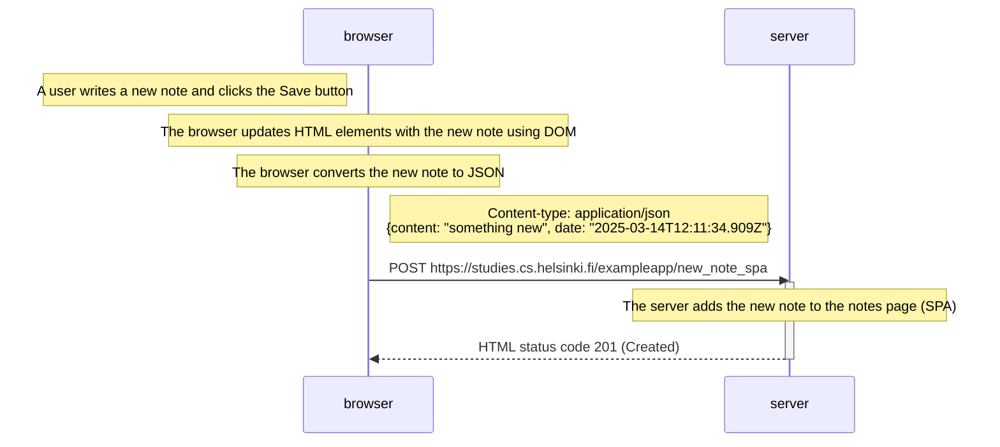

```mermaid
sequenceDiagram
    participant browser
    participant server

    Note left of browser: A user writes a new note and clicks the Save button

    Note over browser: The browser updates HTML elements with the new note using DOM
    Note over browser: The browser converts the new note to JSON
    Note right of browser: Content-type: application/json<br/>{content: "something new", date: "2025-03-14T12:11:34.909Z"}

    browser->>server: POST https://studies.cs.helsinki.fi/exampleapp/new_note_spa
    activate server

    Note over server: The server adds the new note to the notes page (SPA)

    server-->>browser: HTML status code 201 (Created)
    deactivate server
```
